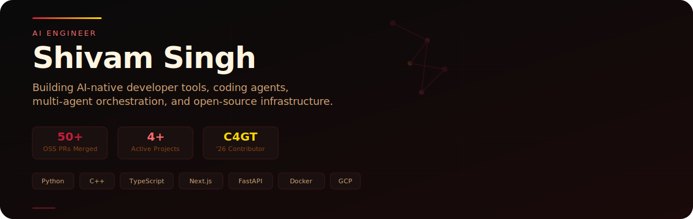
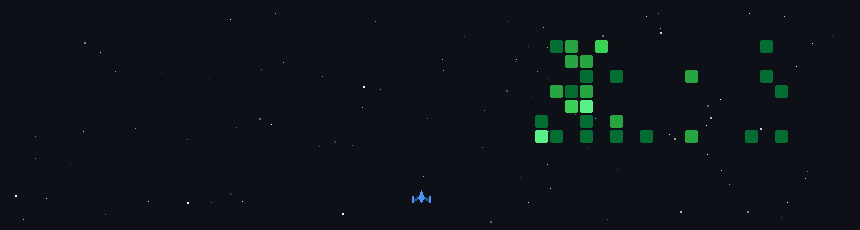

# 🌌 SHIVAM SINGH

---

  
  

<table width="100%">
  <tr>
    <td align="left">
      <strong>AI Engineer.</strong> Learning, Building, and Shipping.
    </td>
    <td align="right">
      <a href="https://github.com/shivamsingh-007">GitHub</a> ·
      <a href="https://linkedin.com/in/shivam-singh-a58364384">LinkedIn</a> ·
      <a href="mailto:shivam.singh.koyad007@gmail.com">Email</a>
    </td>
  </tr>
</table>

I build **AI-native developer tools, coding agents, Multi-agent & Agentic Systems, open-source infrastructure, and Harness systems.**

▸ Building **Sharp Harness**, **Nova Harness**, **Nexus** multi-agent orchestration, **Scout** agentic LOOP 
▸ Open-source contributor in **Kubeflow/notebook**, **Ray**, **T3MP3ST** and more 
▸ **C4GT'26** · **Quiz Frontend** · a generic quiz engine for serving different question types (MCQ, subjective, images, audio) in a mobile-friendly webapp 
▸ **50+ merged OSS PRs** across open-source projects 

Currently building **loops, Agents, contributing to C4GT, and Agentic Systems**.

  <strong>Tech Stack ⚙️</strong>

  
  &nbsp;
  
  &nbsp;
  
  &nbsp;
  
  &nbsp;
  
  &nbsp;
  
  &nbsp;
  
  &nbsp;
  
  &nbsp;
  
  &nbsp;
  
  &nbsp;
  
  &nbsp;
  
  &nbsp;
  
  &nbsp;
  
  &nbsp;
  
  &nbsp;
  
  &nbsp;
  
  &nbsp;
  
  &nbsp;

<!-- Proudly created with GPRM ( https://gprm.itsvg.in ) -->

  

# ■ My GitHub Activity Game

  

